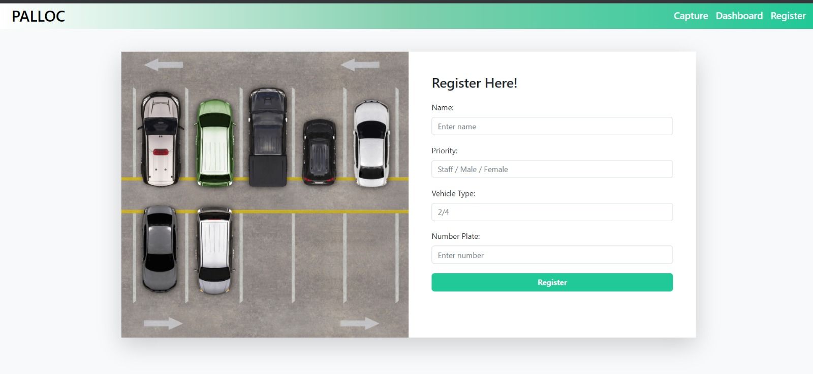
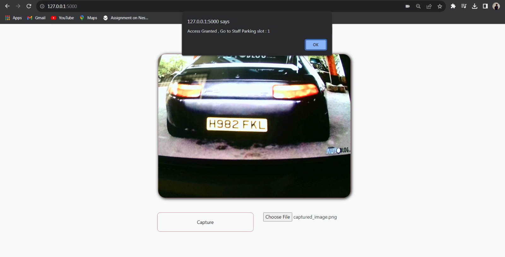
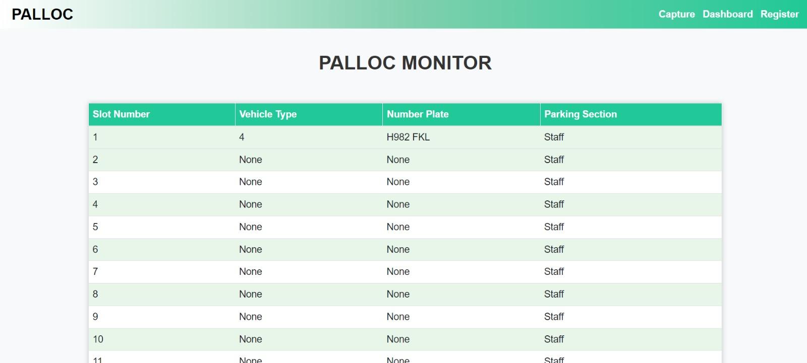

# Palloc -  Parking Allocation System
----
## Overview
Palloc (Parking Allocation System) is an application that detects and recognizes license plates from vehicles.
It allocates parking spots based on the credentials of the person.
Palloc ensures every vehicle finds its perfect place. 
User-friendly and efficient, it's the future of stress-free parking.
 ---- 
## Features

- **License Plate Detection:**  Accurate license plate recognition.
  
- **Swift Allocation:** Allocates parking spaces eliminating the need for endless circling.

- **User-Friendly Interface:** Intuitive interface ensuring a hassle-free experience.
----
## Demo

 ### Registration Page 
 
 
 ### Image Detection
 
 
 ### Dashboard View
 
 ----
### Installation

Clone the repository:

```bash
git clone https://github.com/your-username/palloc.git
```
Verify the python version:

```bash
python --version
```
Install the dependencies:
```bash
pip install -r "requirements.txt"
```

Run python file:
```bash
python app.py
```

----
### Technologies Used
- OpenCV
- Easyocr
- Flask
